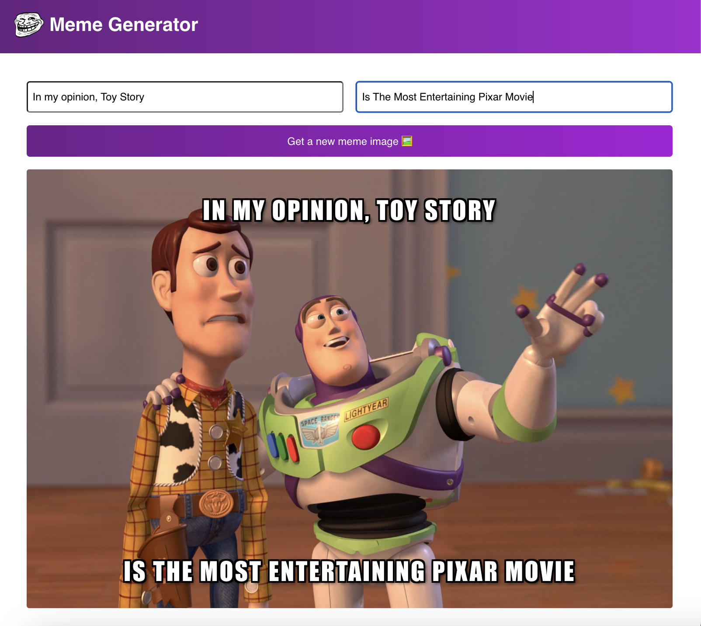

# React-Meme-Generator

Welcome to the React Meme Generator project! This website was built using React and provides a simple and intuitive user interface for creating and customizing memes. With this website, users can choose from a library of images, add text captions, and generate funny and creative memes in just a few clicks.

## Key Features

- **Diverse Meme Selection**: Explore a wide range of popular meme images to serve as the foundation for your unique creations.

- **Real-time Preview**: Witness your meme masterpiece come to life as you tweak captions and switch between images, all in real-time.

- **Interactive UI with React**: Immerse yourself in an interactive user experience powered by React's versatile props and states. The user interface dynamically adapts as you engage with the meme generator.

- **Expansive Image Library**: Embrace limitless creative possibilities with our app's seamless integration of API calls. Fetch a continuous stream of new meme images, ensuring a perpetually growing library for your meme-crafting endeavors.

- **Efficient Forms Handling**: Effortlessly customize your memes using user-friendly forms that make captioning and personalization a breeze.

- **Contextual Rendering**: Experience intelligent UI updates through conditional rendering, ensuring that your interactions consistently align with your creative intentions.

- **Enhanced User Experience with useEffect**: Elevate your user experience through the strategic utilization of React's useEffect hook, guaranteeing smooth and responsive interactions throughout your meme-generating journey.

# Getting Started with Create React App

This project was bootstrapped with [Create React App](https://github.com/facebook/create-react-app).

## Available Scripts

In the project directory, you can run:

### `npm start`

Runs the app in the development mode.\
Open [http://localhost:3000](http://localhost:3000) to view it in your browser.

The page will reload when you make changes.\
You may also see any lint errors in the console.

### `npm test`

Launches the test runner in the interactive watch mode.\
See the section about [running tests](https://facebook.github.io/create-react-app/docs/running-tests) for more information.

### `npm run build`

Builds the app for production to the `build` folder.\
It correctly bundles React in production mode and optimizes the build for the best performance.

The build is minified and the filenames include the hashes.\
Your app is ready to be deployed!

See the section about [deployment](https://facebook.github.io/create-react-app/docs/deployment) for more information.

## Learn More

You can learn more in the [Create React App documentation](https://facebook.github.io/create-react-app/docs/getting-started).

To learn React, check out the [React documentation](https://reactjs.org/).
